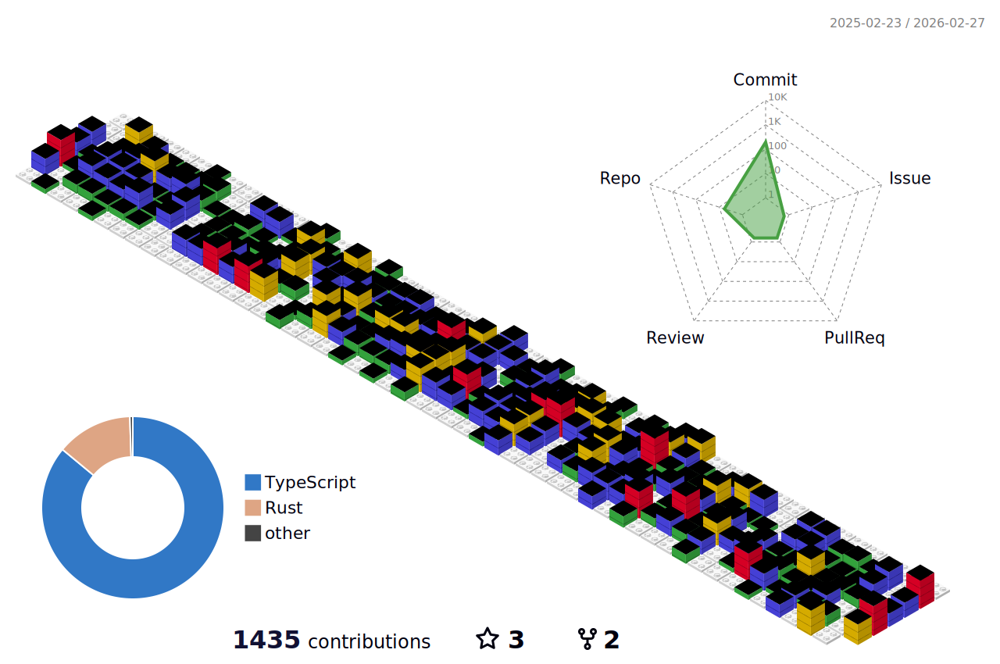

# Me - Felipe Azevedo Bosi

I'm a dedicated frontend engineer who combines a foundation in architecture and urbanism with a passion for technology. With seven years of experience and a Ph.D. under my belt, I've successfully transitioned from designing structures to crafting digital experiences.

My toolkit encompasses TypeScript, JavaScript, React, Redux, GraphQL, and React-query, enabling me to construct systems that not only epitomize technical robustness but also echo a profound emphasis on user experience. Bridging the chasm between creativity and code, I'm devoted to crafting digital realms that resonate seamlessly with users' needs and aspirations.

# My Skills

